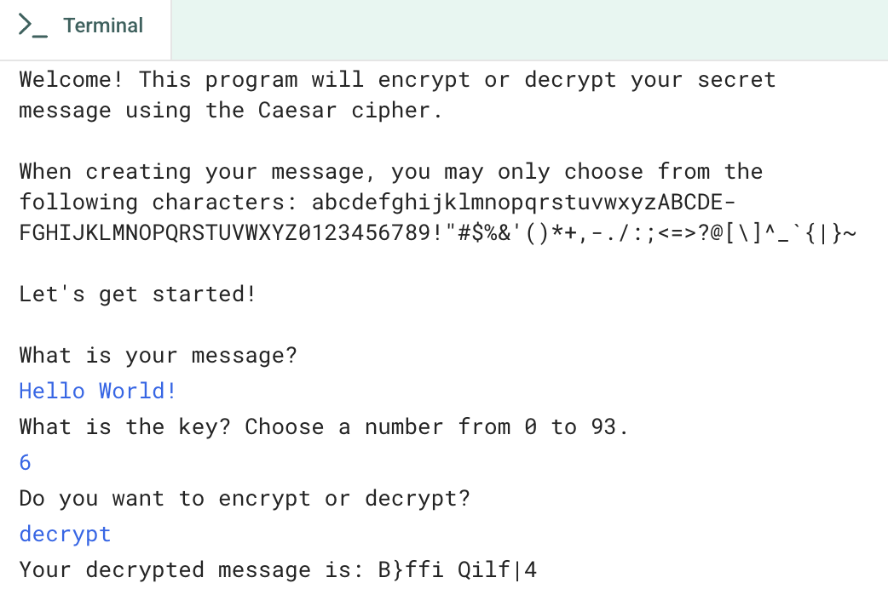

# Cipher Usability
## About the Project
This project is a pretty simple implementation of a Caesar Cipher. It allows the user to encrypt or decrypt a message by shifting the letters of the alphabet by a specified key value. The program also handles wraparound for letters that go beyond 'z' or before 'a'.

## Features
The project could:
- Import the string library to access more characters.
- Share an opening message with the user that describes what the program will do.
- Include user input for the initialMessage (capital letters, lowercase letters, numbers, and keyboard symbols), the key, and the mode (encrypt or decrypt).
- Include a for loop that cycles through each character in the initialMessage.
- Include a conditional statement that allows for multiple word messages.
- Define and call a function called encryptOrDecrypt that stores a conditional statement to encrypt or decrypt the initialMessage based on user input.
- Define and call a function called wraparound() that stores a conditional statement to adjust the position of any wraparound characters.
- Share the shiftedMessage with the user.

## Project Screenshot

